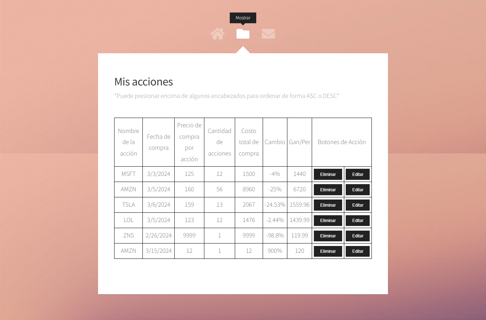

# Actualización del Diseño de Interfaz de Usuario

## Introducción

Este documento describe las actualizaciones realizadas en la interfaz de usuario para incorporar la visualización del porcentaje de cambio (%) y la ganancia/pérdida (Gan/Per) de cada acción en la aplicación.

## Pantalla de Inicio

La pantalla de inicio sigue mostrando los créditos de los autores y no ha sufrido cambios en este ciclo de actualización.

## Pantalla de Mostrar Registros

Se ha actualizado la pantalla "Mostrar Registros" para incluir dos nuevas columnas: % Cambio y Gan/Per.

### Mockup: Mostrar Registros

*Descripción del Mockup:*
- Se añaden las columnas `% Cambio` y `Gan/Per` al final de la tabla de registros.
- Cada fila mostrará los valores calculados correspondientes a las acciones listadas.
- Se ha añadido funcionalidad de ordenamiento al hacer clic en los títulos de estas columnas.

## Pantalla de Ingresar Nueva Acción

La pantalla "Ingresar Nueva Acción" ha sido modificada para permitir la captura de datos que serán utilizados para calcular el % Cambio y la Gan/Per.

### Mockup: Ingresar Nueva Acción

*Descripción del Mockup:*
- Los usuarios pueden ingresar el nombre de la acción, fecha de compra, precio de compra y cantidad.
- Al guardar, el sistema calculará automáticamente el % Cambio y la Gan/Per, aunque estos campos no serán visibles en esta pantalla.

## Pantalla de Edición de Acción

Cuando un usuario elige editar una acción, podrá ver los valores actuales de % Cambio y Gan/Per pero no podrá modificarlos directamente, ya que se calculan automáticamente.

### Mockup: Edición de Acción

*Descripción del Mockup:*
- Al editar una acción, los campos de % Cambio y Gan/Per se muestran en modo solo lectura.
- Los usuarios pueden actualizar el nombre, la fecha de compra, el precio y la cantidad. Los valores de % Cambio y Gan/Per se actualizarán al guardar los cambios.

## Conclusión

Estos cambios en la interfaz de usuario mejoran la claridad y la funcionalidad de la aplicación, permitiendo a los usuarios visualizar y entender mejor el rendimiento de sus inversiones en acciones.
