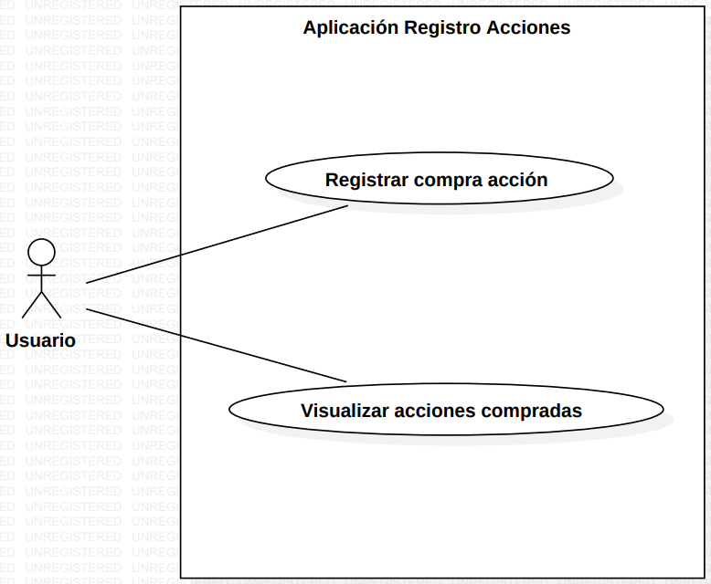

# Construcción y Evolución de Software
## Escuela Politécnica Nacional - Facultad de Ingeniería en Sistemas

### Diagrama casos de uso
**Estudiantes:**  
- Ana Campoverde
- Joel Guingla
- Sebastián Sánchez

En el presente documento se muestra el diagrama de casos de uso planteado.

  

  <em>Figura 1: Diagrama de casos de uso del sistema de registro de Acciones</em>

Podemos observar que el actor Usuario puede realizar dos acciones en el sistema, en una primera instancia tiene la opción de registrar la compra de una nueva acción con los parámetros preestablecidos, como segunda función podrá revisar la lsita de acciones ingresadas en una tabla adicional. Dentro de esta segunda función, se puede optar por tanto actualizar una acción elegida, o eliminarla.
