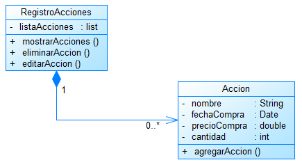

# Construcción y Evolución de Software
## Escuela Politécnica Nacional - Facultad de Ingeniería en Sistemas

### Diagrama clases
**Estudiantes:**  
- Ana Campoverde
- Joel Guingla
- Sebastián Sánchez

En el presente documento se muestra el diagrama de clases planteado.

  

  <em>Figura 1: Diagrama de clases del sistema de registro de Acciones</em>

Aquí podemos observar que se han definido dos clases.

- Accion: Aquí se registrarán los datos respectivos a la acción y se registrará dicha acción en una lista.
- RegistroAcciones: En esta clase se recibe como atributo la lsita de acciones, con la cual se podrá mostrar las acciones, editarlas o eliminarlas.
